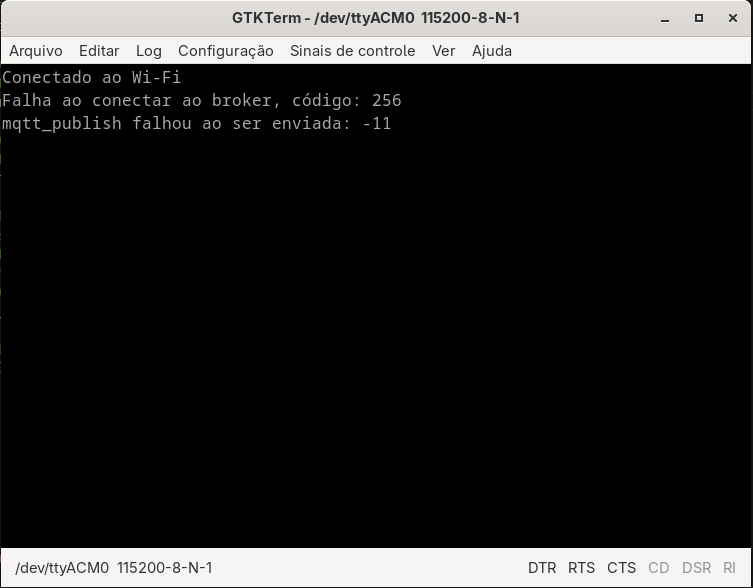
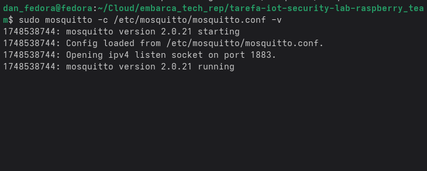
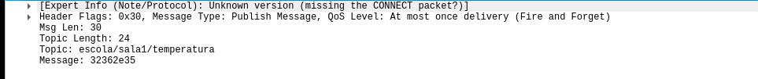
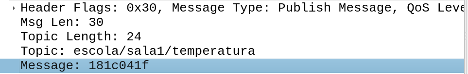

[](https://classroom.github.com/a/G8V_0Zaq)

# Tarefa: IoT Security Lab - EmbarcaTech 2025

Autor: **Danilo Naves do Nascimento e Gabriel Martins Ribeiro**

Curso: Residência Tecnológica em Sistemas Embarcados

Instituição: EmbarcaTech - HBr

Brasília, 27 de Maio de 2025

---

# Introdução

Aqui se encontra a introdução da atividade

## 1. Configuração/inicialização do Wi-fi

Para configurar o wifi, já existe uma função fornecida para isso. Então foi apenas necessário trocar as informações de conexão de rede.

```c
connect_to_wifi("Nome do Wifi", "Senha");
```



| Conexão feita com wi-fi

## 2.  Configuração do Broker Local - Mosquitto

Para inicializar e configurar o mosquitto no Fedora 42 foi adicionado as seguintes linhas no arquivo ```/etc/mosquitto/mosquitto.conf```

```shell
listener 1883 0.0.0.0 // Porta padrão e aceitar endereços Ip de diferentes máquinas
```

```shell
allow_anonymous falso // Modo com autenticação
password_file /etc/mosquitto/passwd // Configuração com usuários para autenticação
```

Após isso, inicializar o servidor mosquitto com o seguinte comando:

```
sudo mosquitto -c /etc/mosquitto/mosquitto.conf -v // "-c" para indicar caminho do arquivo de configuração. "-v" para apresentar todos os logs de mensagem.
```



Após a configuração do broker, é necessário configurar o endereço ip, nome e senha do broker na bitdoglab.

O código fornecido já possui um função preparada para somente passar os parâmetros corretos.


| O ip `192.168.15.14` é o ip do broker.

| Os outros campos são, respectivamente, `Nome do cliente`, `Nome de usuário` e `Senha de usuário`.

Por fim, a pico W já está pronta para enviar mensagens aos tópicos.

## Envio de mensagens a tópicos

Para enviar mensagem a um tópico, foi utilizado a função `mqtt_comm_publish`


Ao enviar a mensagem, a seguinte mensagem é printada no terminal serial da bitdoglab.


No wireshark, é possível ver o corpo da mensagem


## Teste de autenticação e Criptografia

Caso o cliente use algum usuário ou senha não cadastrada no `/etc/mosquitto/passwd`, é retornado o erro `not authorised`.


Caso o usuário seja autenticado. A conexão com o broker será feita com sucesso.


Um problema notável é a falta de privacidade sobre as informações acerca dos tópicos e dos corpos das mensagens. Sem uma criptografia, o pacote MQTT pode sofrer ataques conhecido como Man-the-Middle, onde o atacante pode ler os corpos do pacote, alterar e fazer tentativas de replays.

A seguinte saída é recuperada pelo wireshark quando a mensagem é enviada pela rede.



Para resolver esse problema, é necessário criptografar a mensagem. Para isso, foi utilizado a criptografia XOR para isso. A função `xor_encrypt` foi utilizada para isso.

A seguinte saída é recuperada pelo wireshark quando o pacote foi enviado para rede.



Como visto, o valor enviado pela rede, agora é criptografado.

## Comunicação entre as duas placas e proteção contra replay

Para a comunicação entre placa, foi necessário implementar as funções responsáveis por assinar os tópicos disponíveis no broker mosquitto.

A função principal `mqtt_comm_subscribe` e seu conjunto foi implementada na arquivo/include `mqtt_commom.c/h`, nesta função, a segunda placa bitdoglab consegue recuperar os tópicos já enviados pela primeira placa e todas conectadas aquele broker.


Entrentanto, é necessário algumas validações para garantir a leitura desta mensagem.

1. Descriptografar a mensagem quando o assinante receber a mensagem.


2. Proteção contra replay.

Para garantir a segurança da mensagem contra replay, é necessário que a mensagem venha acompanhada por um timestamp.

Corpo da mensagem necessária:

```json
{
    "mensagem": "Mensagem em string",
    "ts": 30
}
```

Neste caso, o valor de timestamp foi gerado pela função time(NULL), onde é retornado o tempo atual de execução da pico W.

A proteção de replay verifica se a mensagem não foi enviada a 30 segundos antes. Caso a mensagem tenha um tempo menor que 30 segundos, a mensagem é negada pelo assinante.


---

# Questionário de Análise

## Quais técnicas são escaláveis

1. A utilização do protocolo MQTT (Publish/Subscribe) permite a comunicação entre uma rede de placas. Aém disso, um broker bem dimensionado pode suportar centenas de cliêntes simultâneos.

2. A criptografia pode ser escalada para uma criptografia simétrica bem mais robusta.

3. Para aumentar mais a segurança, é recomendado usar o TLS (Transport Layer Security), pois assim, todo o diálogo fica criptografado.

## Como aplicá-las com várias BitDogLab em rede escolar?

Para aplicar várias Raspberry Pi Pico W em uma rede escolar, é possível conectá-las entre si por meio do protocolo MQTT. Assim, permitindo que os dispositivos se comuniquem publicando e assinando mensagens em um broker central — o que facilita o gerenciamento e a escalabilidade em ambientes educacionais com múltiplos dispositivos.

## Passos para Aplicação na Rede Escolar

1. **Instalação de um Broker MQTT Local**
   Instale um broker como o *Mosquitto* em um servidor da escola ou em um computador que ficará sempre ligado. Ele será o ponto central de comunicação entre as placas.

2. **Conexão das Pico W ao Wi-Fi da Escola**
   Cada Pico W deve ser configurada para se conectar à rede Wi-Fi da escola e estabelecer comunicação com o broker MQTT.

3. **Estruturação dos Tópicos MQTT**
   Defina uma organização lógica de tópicos (ex: `sala1/temp`, `lab2/presenca`) para que os dispositivos saibam o que enviar e o que escutar.

4. **Publicação e Subscrição**
   Configure as Pico W para enviarem dados (ex: sensores, botões) e escutarem comandos (ex: acionar LEDs, exibir mensagens) por meio desses tópicos.

Por ser um ambiente educacional, a segurança é essencial, mesmo em redes locais. Para isso, é importante adotar práticas como:

* **Criptografia com TLS**: Configure o broker para usar conexões seguras (MQTTS), protegendo os dados em trânsito contra interceptações.

* **Autenticação com usuário e senha**: Cada Pico W deve usar credenciais para se conectar, impedindo acesso de dispositivos desconhecidos.

* **Controle de acesso (ACLs)**: Restringa quais tópicos cada dispositivo pode publicar ou assinar, evitando que um dispositivo interfira nos dados de outro.

* **Monitoramento de atividades**: Ative logs no broker para auditar conexões, detectar falhas e garantir integridade do sistema.

---

## 📜 Licença
GNU GPL-3.0.
